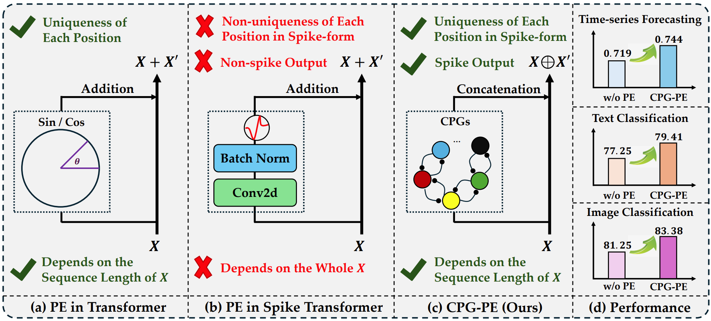
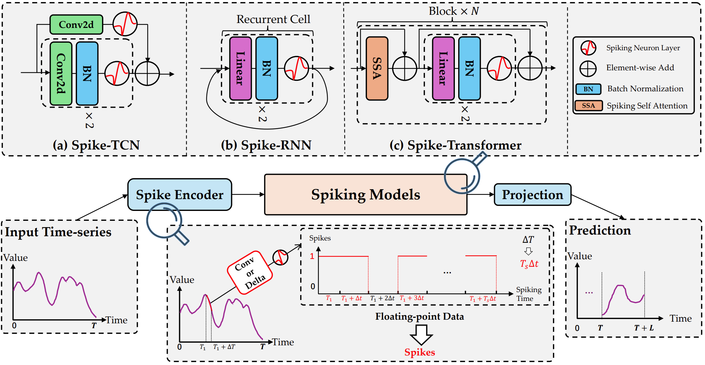
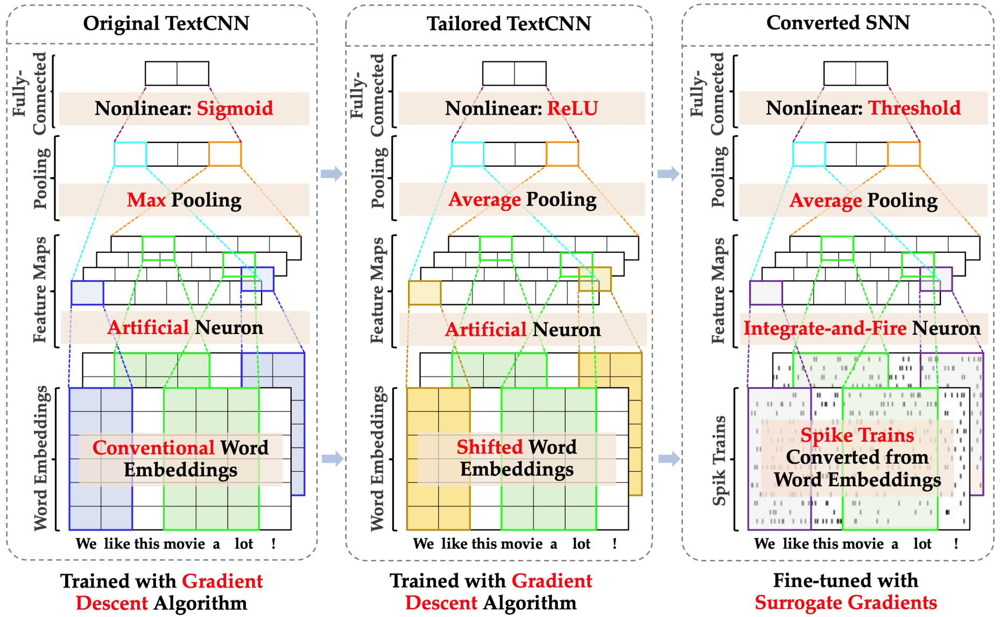
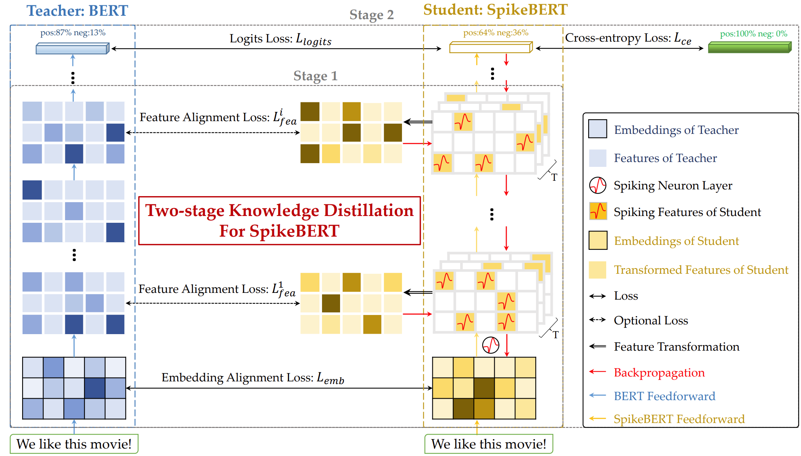
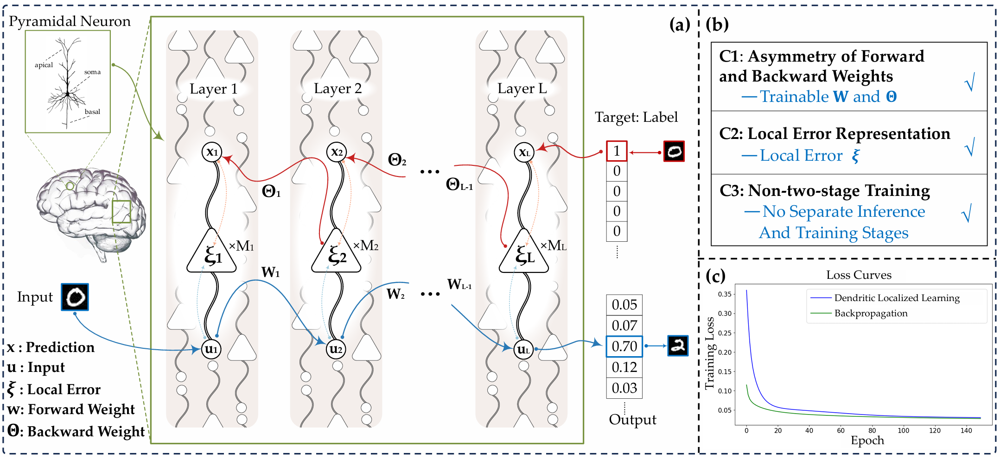
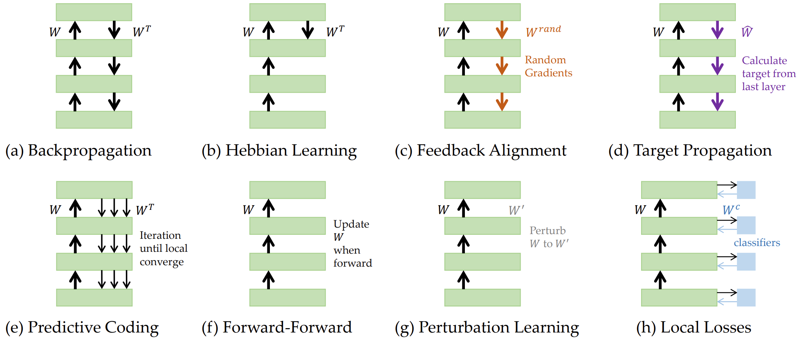








I'm currently a Ph.D. student (from fall, 2022) at the [School of Computer Science](https://cs.fudan.edu.cn/) of [Fudan University](https://www.fudan.edu.cn/) and a member of the [FudanNLP Lab](https://nlp.fudan.edu.cn/), advised by A.P. [Xiaoqing Zheng (郑骁庆)](https://faculty.fudan.edu.cn/zhengxq/zh_CN/) and Prof. [Xuanjing Huang (黄萱菁)](https://xuanjing-huang.github.io/).

My research interests cover Brain-inspired Computing, Large Language Models, and Multi-Modal LLMs.
I am currently working on **Spiking Neural Networks for Sequential Tasks** and **Biologically-Plausible Learning Algorithms**.

First-author Publications: ICLR 2023, ICML 2024, NeurIPS 2024.

Co-author Publications: ACL, EMNLP, COLING.

I serve as the reviewer for conferences (ICML 2025, ICLR 2025, NeurIPS 2024) and journals (Neural Networks).

# 🔥 News
- *2024.12*: &nbsp;🎉🎉 One paper on Jailbreak of LLMs was accepted by **COLING-2025**!
- *2024.09*: &nbsp;🎉🎉 One paper on positional encoding for SNNs was accepted by **NeurIPS-2024-Spotlight**!
- *2024.09*: &nbsp;🎉🎉 Two papers on RAG and LLM safety were accepted by **EMNLP-2024-Main/Findings**!
- *2024.05*: &nbsp;🎉🎉 Two papers on LLM alignment and PEFT were accepted by **ACL-2024-Main**!
- *2024.05*: &nbsp;🎉🎉 One paper on time-series forecasting with spiking neural networks was accepted by **ICML-2024**!
- *2023.10*: &nbsp;🎉🎉 One paper on parameter-efficient-fine-tuning was accepted by **EMNLP-2023-Findings**!
- *2023.01*: &nbsp;🎉🎉 One paper on spiking neural networks for text classification was accepted by **ICLR-2023**!

# 📝 Publications

## Spiking Neural Networks

NeurIPS 2024 (Spotlight)

Advancing Spiking Neural Networks for Sequential Modeling with Central Pattern Generators \\
**Changze Lv**, Dongqi Han, Yansen Wang, et al.
- A bio-inspired novel positional encoding method for spiking neural networks.
-  \|  

ICML-2024 (Poster)

Efficient and Effective Time-Series Forecasting with Spiking Neural Networks \\
**Changze Lv**, Yansen Wang, Dongqi Han, et al.
- A framework for spiking neural networks in time-series forecasting tasks.
-  \|  

ICLR-2023 (Poster)

Spiking Convolutional Neural Networks for Text Classification \\
**Changze Lv**, Jianhan Xu, Xiaoqing Zheng
- A "conversion+ fine-tuning" two-step method for training SNNs for text classification.
-  \|  

Arxiv(2308.15122)

SpikeBERT: A Language Spikformer Trained with Two-stage Knowledge Distillation from BERT \\
**Changze Lv**, Tianlong Li, Jianhan Xu, et al.
- A spiking language model for language understanding based on Spikformer.
-  \|  

## Brain-Inspired Learning

Arxiv(2501.09976)

Dendritic Localized Learning: Toward Biologically Plausible Algorithm \\
**Changze Lv**\*, Jingwen Xu\*, Yiyang Lu\*, et al.
- A novel biologically plausible training method.
- 

Arxiv(2406.16062)

Towards Biologically Plausible Computing: A Comprehensive Comparison \\
**Changze Lv**, Yufei Gu, Zhengkang Guo, et al.
- A comprehensive comparison of various brain-inspired training methods.
- 

## Others

-  Revisiting Jailbreaking for Large Language Models: A Representation Engineering Perspective
  Tianlong Li, Zhenghua Wang, Wenhao Liu, Muling Wu, Shihan Dou, **Changze Lv**, Xiaohua Wang, Xiaoqing Zheng, Xuanjing Huang
  

-  Searching for Best Practices in Retrieval-Augmented Generation
  Xiaohua Wang, Zhenghua Wang, Xuan Gao, Feiran Zhang, Yixin Wu, Zhibo Xu, Tianyuan Shi, Zhengyuan Wang, Shizheng Li, Qi Qian, Ruicheng Yin, **Changze Lv**, Xiaoqing Zheng, Xuanjing Huang
   | 

-  Promoting Data and Model Privacy in Federated Learning through Quantized LoRA
  JianHao Zhu, **Changze Lv**, Xiaohua Wang, Muling Wu, Wenhao Liu, Tianlong Li, Zixuan Ling, Cenyuan Zhang, Xiaoqing Zheng, Xuanjing Huang
  

-  Aligning Large Language Models with Human Preferences through Representation Engineering
  Wenhao Liu, Xiaohua Wang, Muling Wu, Tianlong Li, **Changze Lv**, Zixuan Ling, Jianhao Zhu, Cenyuan Zhang, Xiaoqing Zheng, Xuanjing Huang
   | 

-  Advancing Parameter Efficiency in Fine-tuning via Representation Editing
  Muling Wu, Wenhao Liu, Xiaohua Wang, Tianlong Li, **Changze Lv**, Zixuan Ling, Jianhao Zhu, Cenyuan Zhang, Xiaoqing Zheng, Xuanjing Huang
   | 

-  Parameter Efficient Multi-task Fine-tuning by Learning to Transfer Token-wise Prompts
  Muling Wu, Wenhao Liu, Jianhan Xu, **Changze Lv**, Zixuan Ling, Tianlong Li, Longtao Huang, Xiaoqing Zheng, Xuan-Jing Huang
   | 

-  Tailoring Personality Traits in Large Language Models via Unsupervisedly-Built Personalized Lexicons
  Tianlong Li, Shihan Dou, **Changze Lv**, Wenhao Liu, Jianhan Xu, Muling Wu, Zixuan Ling, Xiaoqing Zheng, Xuanjing Huang
  

-  SpikeCLIP: A Contrastive Language-Image Pretrained Spiking Neural Network
  Tianlong Li, Wenhao Liu, **Changze Lv**, Jianhan Xu, Cenyuan Zhang, Muling Wu, Xiaoqing Zheng, Xuanjing Huang
  

-  Decoding Continuous Character-based Language from Non-invasive Brain Recordings
  Cenyuan Zhang, Xiaoqing Zheng, Ruicheng Yin, Shujie Geng, Jianhan Xu, Xuan Gao, **Changze Lv**, Zixuan Ling, Xuanjing Huang, Miao Cao, Jianfeng Feng
  

-  Multi-Programming Language Sandbox for LLMs
  Shihan Dou, Jiazheng Zhang, Jianxiang Zang, Yunbo Tao, Haoxiang Jia, Shichun Liu, Yuming Yang, Shenxi Wu, Shaoqing Zhang, Muling Wu, **Changze Lv**, Limao Xiong, Wenyu Zhan, Lin Zhang, Rongxiang Weng, Jingang Wang, Xunliang Cai, Yueming Wu, Ming Wen, Rui Zheng, Tao Ji, Yixin Cao, Tao Gui, Xipeng Qiu, Qi Zhang, Xuanjing Huang
  

# 🎖 Honors and Awards
- *2024* Outstanding Student Leader of Fudan University (复旦大学优秀学生干部)
- *2023* Outstanding Student of Fudan University (复旦大学优秀学生)
- *2022* Excellent graduates of Fudan University (复旦大学优秀毕业生)
- *2021* Shanghai Scholarship (上海市奖学金)
- *2021* First Prize for Outstanding Undergraduate Student Scholarship, Fudan University (复旦大学一等奖学金)
- *2020* Meritorious Prize in the Mathematical Contest in Modeling/Interdisciplinary Contest In Modeling (美国数学建模大赛M奖)
- *2019* Third Prize in the National College Student Mathematics Competition (全国大学生数学竞赛三等奖)

# 📖 Educations
- *2022.09 - Current*, Ph.D. Student in Computer Science (School of Computer Science, Fudan University).
- *2019.09 - 2022.06*, Bachelor in Economics (School of Economics and Management, Fudan University, Second Degree)
- *2018.09 - 2022.06*, Bachelor in Software Engineering (School of Software, Fudan University)

# 💻 Internships
- *2023.11 - Current*, Microsoft Research Asia, Artificial Intelligence & Machine Learning Group, [MSRA](https://www.msra.cn/).
