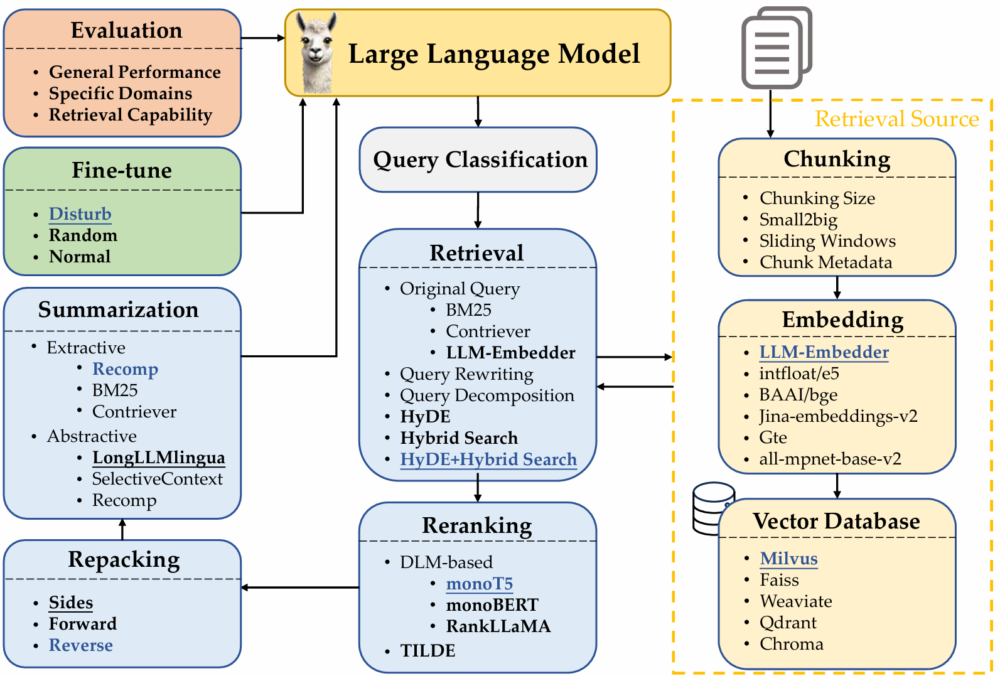
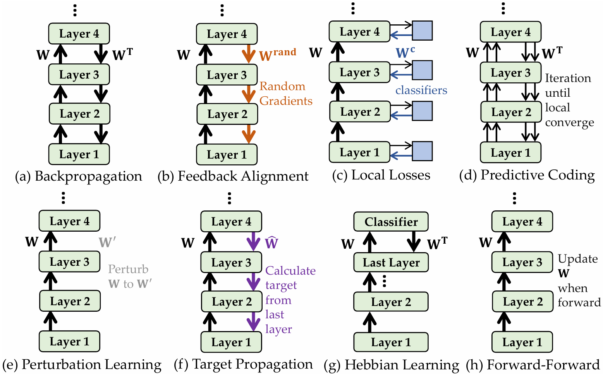








I'm currently a Ph.D. student (from fall 2022) at the [School of Computer Science](https://cs.fudan.edu.cn/) of [Fudan University](https://www.fudan.edu.cn/) and a member of the [FudanNLP Lab](https://nlp.fudan.edu.cn/), supervised by A.P. [Xiaoqing Zheng (郑骁庆)](https://faculty.fudan.edu.cn/zhengxq/zh_CN/) and Prof. [Xuanjing Huang (黄萱菁)](https://xuanjing-huang.github.io/).

My research interests include Brain-inspired Computing, Agentic RL, LLM Reasoning, Time Series Analysis, and AI for Science.
I am currently working on Agentic Reinforcement Learning, Generative Protein Foundation Models, and Biologically-Plausible Learning Algorithms.

I have led first-author research published at ICML, NeurIPS, and ICLR, and have also contributed as a co-author to works appearing at ACL, EMNLP, WWW, COLING, InfoCom, and IJCAI.

I serve as the reviewer for conferences (ICML, ICLR, NeurIPS, ACL, EMNLP, ICCV, IJCAI, AAAI, ACM MM, COLING) and journals (IEEE Transactions on Affective Computing, IEEE Transactions on Neural Networks and Learning Systems, IEEE Transactions on Cognitive and Developmental Systems, Neural Networks).

Phone/Wechat/Telegram: (+86) 13967492189. Please feel free to reach out to me.

# 📖 Educations
- *2018.09 - 2022.06*, Bachelor in Software Engineering (School of Software, Fudan University)
- *2019.09 - 2022.06*, Bachelor in Economics (School of Economics and Management, Fudan University, Second Degree)
- *2022.09 - 2027.06 (Expected)*, Ph.D. Student in Computer Science (School of Computer Science, Fudan University).

# 💻 Internships
- *2023.11 - 2025.02*, [Microsoft Research Asia](https://www.msra.cn/). Artificial Intelligence & Machine Learning Group. Research on time-series forecasting. Supervised by [Yansen Wang](https://scholar.google.com/citations?user=Hvbzb1kAAAAJ&hl=en), [Dongqi Han](https://scholar.google.com.hk/citations?user=3V_9fRUAAAAJ&hl=zh-CN), and [Dongsheng Li](https://scholar.google.com/citations?user=VNg5rA8AAAAJ&hl=zh-CN).
- *2025.03 - 2025.09*, [Shanghai AI Lab](https://www.shlab.org.cn/). AI for Science Group. Research on protein foundation models. Supervised by [Lihao Wang](https://github.com/leowang1217), [Jiangtao Feng](https://scholar.google.com/citations?user=7ufSFeIAAAAJ&hl=en), and [Hao Zhou](https://zhouh.github.io/).
- *2025.09 - Current*, [Tencent](https://www.tencent.com/zh-cn/index.html). Qingyun Plan (青云计划) at WeChat AI Group. Research on agentic reinforcement learning. Supervised by [Le Tian](https://openreview.net/profile?id=%7ELe_Tian1).

# 🔥 News
- *2026.01*: &nbsp;🎉🎉 One paper on Neuromorphic Edge Sensing was accepted by **WWW-2026**!
- *2025.12*: &nbsp;🎉🎉 One paper on Pretrained Spiking Language Model SpikeBERT was accepted by **Neural-Networks**!
- *2025.12*: &nbsp;🎉🎉 One paper on SNN Time Parallelism and Asynchronous Pipeline was accepted by **InfoCom-2026**!
- *2025.11*: &nbsp;🎉🎉 One paper on AIGC detection was accepted by **AAAI-2026**!
- *2025.09*: &nbsp;🎉🎉 One paper on Relative Positional Encoding for SNNs was accepted by **NeurIPS-2025-Spotlight**!
- *2025.09*: &nbsp;🎉🎉 Two papers on LLMs safety and personality were accepted by **EMNLP-2025-Findings**!
- *2025.05*: &nbsp;🎉🎉 Five papers on LLMs were accepted by **ACL-2025-Main/Findings/Demo**!
- *2025.05*: &nbsp;🎉🎉 One paper on Biologically-Plausible Learning Algorithm was accepted by **ICML-2025**!
- *2025.04*: &nbsp;🎉🎉 Two papers on On-device SNNs was accepted by **IJCAI-2025**!
- *2025.04*: &nbsp;🎉🎉 One paper on Multi-Modal SpikeCLIP was accepted by **Neural-Networks**!
- *2024.12*: &nbsp;🎉🎉 One paper on Jailbreak of LLMs was accepted by **COLING-2025**!
- *2024.09*: &nbsp;🎉🎉 One paper on Positional Encoding Analysis for SNNs was accepted by **NeurIPS-2024-Spotlight**!
- *2024.09*: &nbsp;🎉🎉 Two papers on RAG and LLM safety were accepted by **EMNLP-2024-Main/Findings**!
- *2024.05*: &nbsp;🎉🎉 Two papers on LLM alignment and PEFT were accepted by **ACL-2024-Main**!
- *2024.05*: &nbsp;🎉🎉 One paper on Time-Series Forecasting with SNNs was accepted by **ICML-2024**!
- *2023.10*: &nbsp;🎉🎉 One paper on Parameter-Efficient-Fine-Tuning of LLMs was accepted by **EMNLP-2023-Findings**!
- *2023.01*: &nbsp;🎉🎉 One paper on SNNs for Text Classification was accepted by **ICLR-2023**!

# 📚 Technical Reports

AMix-1

AMix-1: A Pathway to Test-Time Scalable Protein Foundation Model
- Shanghai AI Lab & Tsinghua AIR GenSI Lab
- A powerful protein foundation model built on Bayesian Flow Networks and engined by a systematic training methodology, encompassing pretraining scaling laws, emergent capability analysis, in-context learning strategy, and test-time scaling algorithm. I was responsible for pretraining, scaling laws, and emergent ability.
-  \|  

RAG

Searching for Best Practices in Retrieval-Augmented Generation
- FudanNLP Group
- This study investigates the contribution of each component and provides insights into optimal RAG practices through extensive experimentation.
-  \|  

# 📝 Publications

## Brain-Inspired Computing

NeurIPS 2025 (Spotlight)

  
Toward Relative Positional Encoding in Spiking Transformers \\
**Changze Lv**, Yansen Wang, Dongqi Han, et al.
- A relative positional encoding for spiking Transformers based on Gray Code and logarithm.
-  \|   

ICML-2025 (Poster)

  
Dendritic Localized Learning: Toward Biologically Plausible Algorithm \\
**Changze Lv**\*, Jingwen Xu\*, Yiyang Lu\*, et al.
- A new biologically plausible training method.
-  \|  

NeurIPS 2024 (Spotlight)

  
Advancing Spiking Neural Networks for Sequential Modeling with Central Pattern Generators \\
**Changze Lv**, Dongqi Han, Yansen Wang, et al.
- A bio-inspired novel positional encoding method for spiking neural networks.
-  \|  

ICML-2024 (Poster)

  
Efficient and Effective Time-Series Forecasting with Spiking Neural Networks \\
**Changze Lv**, Yansen Wang, Dongqi Han, et al.
- A framework for spiking neural networks in time-series forecasting tasks.
-  \|  

ICLR-2023 (Poster)

  
Spiking Convolutional Neural Networks for Text Classification \\
**Changze Lv**, Jianhan Xu, Xiaoqing Zheng
- A "conversion + fine-tuning" two-step method for training SNNs for text classification.
-  \|  

Neural Networks

  
SpikeCLIP: A Contrastive Language-Image Pretrained Spiking Neural Network \\
**Changze Lv**\*, Tianlong Li\*, Xiaoqing Zheng, et al
- A method for training language-image multimodal SNNs.
-  \| 

Neural Networks

  
SpikeBERT: A Language Spikformer Trained with Two-stage Knowledge Distillation from BERT \\
**Changze Lv**, Tianlong Li, Jianhan Xu, et al.
- A spiking language model for language understanding based on Spikformer.
-  \|  

ArXiv (2509.20284)

  
Biologically Plausible Learning via Bidirectional Spike-Based Distillation \\
**Changze Lv**\*, Yifei Wang\*, Yanxun Zhang\*, et al.
- Bidirectional Spike-based Distillation (BSD), a novel learning algorithm that jointly trains a feedforward and a backward SNN.
- 

Arxiv(2406.16062)

  
Towards Biologically Plausible Computing: A Comprehensive Comparison \\
**Changze Lv**, Yufei Gu, Zhengkang Guo, et al.
- A comprehensive comparison of various brain-inspired training methods.
- 

## Large Language Models

Arxiv(2503.04355)

Layer-Specific Scaling of Positional Encodings for Superior Long-Context Modeling \\
Zhenghua Wang\*, Yiran Ding\*, **Changze Lv**\*, et al.
- A layer-specific positional encoding scaling method.
- 

## Others

-  Explainable Synthetic Image Detection through Diffusion Timestep Ensembling
  Yixin Wu, Feiran Zhang, Tianyuan Shi, Ruicheng Yin, Zhenghua Wang, Zhenliang Gan, Xiaohua Wang, **Changze Lv**, Xiaoqing Zheng, Xuanjing Huang
  

-  Enhancing Model Privacy in Federated Learning with Random Masking and Quantization
  Zhibo Xu, JianHao Zhu, Jingwen Xu, **Changze Lv**, Zhenghua Wang, Zisu Huang, Xiaohua Wang, Muling Wu, Qi Qian, Xiaoqing Zheng, Xuanjing Huang
   | 

-  UPLex: Fine-Grained Personality Control in Large Language Models via Unsupervised Lexical Modulation
  Tianlong, Wenhao Liu, Muling Wu, Shihan Dou, Zhenghua Wang, **Changze Lv**, Xiaohua Wang, Xiaoqing Zheng, Xuanjing Huang
  

-  Beyond Single Labels: Improving Conversational Recommendation through LLM-Powered Data Augmentation
  Haozhe Xu, Xiaohua Wang, **Changze Lv**, Xiaoqing Zheng
   | 

-  TripTailor: A Real-World Benchmark for Personalized Travel Planning
  Kaimin Wang, Yuanzhe Shen, **Changze Lv**, Xiaoqing Zheng, Xuanjing Huang
   | 

-  	
Tell Me What You Don’t Know: Enhancing Refusal Capabilities of Role-Playing Agents via Representation Space Analysis and Editing
  Wenhao Liu, Siyu An, Junru Lu, Muling Wu, Tianlong Li, Xiaohua Wang, **Changze Lv**, Xiaoqing Zheng, Di Yin, Xing Sun, Xuanjing Huang
  

-  Improving Continual Pre-training Through Seamless Data Packing
  Ruicheng Yin, Xuan Gao, **Changze Lv**, Xiaohua Wang, Xiaoqing Zheng, Xuanjing Huang
   | 

-  Multi-Programming Language Sandbox for LLMs
  Shihan Dou, Jiazheng Zhang, Jianxiang Zang, Yunbo Tao, Haoxiang Jia, Shichun Liu, Yuming Yang, Shenxi Wu, Shaoqing Zhang, Muling Wu, **Changze Lv**, Limao Xiong, Wenyu Zhan, Lin Zhang, Rongxiang Weng, Jingang Wang, Xunliang Cai, Yueming Wu, Ming Wen, Rui Zheng, Tao Ji, Yixin Cao, Tao Gui, Xipeng Qiu, Qi Zhang, Xuanjing Huang
  

-  ECC-SNN: Cost-Effective Edge-Cloud Collaboration for Spiking Neural Networks
  Di Yu, **Changze Lv**, Xin Du, Linshan Jiang, Wentao Tong, Zhenyu Liao, Xiaoqing Zheng, Shuiguang Deng
   | 

-  Cost-Effective On-Device Sequential Recommendation with Spiking Neural Networks
  Di Yu, **Changze Lv**, Xin Du, Linshan Jiang, Qin Yin, Wentao Tong, Xiaoqing Zheng, Shuiguang Deng
   | 

-  Revisiting Jailbreaking for Large Language Models: A Representation Engineering Perspective
  Tianlong Li, Zhenghua Wang, Wenhao Liu, Muling Wu, Shihan Dou, **Changze Lv**, Xiaohua Wang, Xiaoqing Zheng, Xuanjing Huang
  

-  Searching for Best Practices in Retrieval-Augmented Generation
  Xiaohua Wang, Zhenghua Wang, Xuan Gao, Feiran Zhang, Yixin Wu, Zhibo Xu, Tianyuan Shi, Zhengyuan Wang, Shizheng Li, Qi Qian, Ruicheng Yin, **Changze Lv**, Xiaoqing Zheng, Xuanjing Huang
   | 

-  Promoting Data and Model Privacy in Federated Learning through Quantized LoRA
  JianHao Zhu, **Changze Lv**, Xiaohua Wang, Muling Wu, Wenhao Liu, Tianlong Li, Zixuan Ling, Cenyuan Zhang, Xiaoqing Zheng, Xuanjing Huang
  

-  Aligning Large Language Models with Human Preferences through Representation Engineering
  Wenhao Liu, Xiaohua Wang, Muling Wu, Tianlong Li, **Changze Lv**, Zixuan Ling, Jianhao Zhu, Cenyuan Zhang, Xiaoqing Zheng, Xuanjing Huang
   | 

-  Advancing Parameter Efficiency in Fine-tuning via Representation Editing
  Muling Wu, Wenhao Liu, Xiaohua Wang, Tianlong Li, **Changze Lv**, Zixuan Ling, Jianhao Zhu, Cenyuan Zhang, Xiaoqing Zheng, Xuanjing Huang
   | 

-  Parameter Efficient Multi-task Fine-tuning by Learning to Transfer Token-wise Prompts
  Muling Wu, Wenhao Liu, Jianhan Xu, **Changze Lv**, Zixuan Ling, Tianlong Li, Longtao Huang, Xiaoqing Zheng, Xuan-Jing Huang
   | 

-  SpikeSTAG: Spatial-Temporal Forecasting via GNN-SNN Collaboration
  Bang Hu, **Changze Lv**, Mingjie Li, Yunpeng Liu, Xiaoqing Zheng, Fengzhe Zhang, Fan Zhang
  

-  STF: Shallow-Level Temporal Feedback to Enhance Spiking Transformers
  Zeqi Zheng, Zizheng Zhu, Yingchao Yu, Yanchen Huang, **Changze Lv**, Junfeng Tang, Zhaofei Yu, Yaochu Jin
  

-  Edge Intelligence with Spiking Neural Networks
  Shuiguang Deng, Di Yu, **Changze Lv**, Xin Du, Linshan Jiang, Xiaofan Zhao, Wentao Tong, Xiaoqing Zheng, Weijia Fang, Peng Zhao, Gang Pan, Schahram Dustdar, Albert Y Zomaya
  

-  Progressive Mastery: Customized Curriculum Learning with Guided Prompting for Mathematical Reasoning
  Muling Wu, Qi Qian, Wenhao Liu, Xiaohua Wang, Zisu Huang, Di Liang, LI Miao, Shihan Dou, **Changze Lv**, Zhenghua Wang, Zhibo Xu, Lina Chen, Tianlong Li, Xiaoqing Zheng, Xuanjing Huang
  

-  Decoding Continuous Character-based Language from Non-invasive Brain Recordings
  Cenyuan Zhang, Xiaoqing Zheng, Ruicheng Yin, Shujie Geng, Jianhan Xu, Xuan Gao, **Changze Lv**, Zixuan Ling, Xuanjing Huang, Miao Cao, Jianfeng Feng
  

-  RECAST: Strengthening LLMs' Complex Instruction Following with Constraint-Verifiable Data
  Wenhao Liu, Zhengkang Guo, Mingchen Xie, Jingwen Xu, Zisu Huang, Muzhao Tian, Jianhan Xu, Muling Wu, Xiaohua Wang, **Changze Lv**, He-Da Wang, Hu Yao, Xiaoqing Zheng, Xuanjing Huang
  

-  SAFA-SNN: Sparsity-Aware On-Device Few-Shot Class-Incremental Learning with Fast-Adaptive Structure of Spiking Neural Network
  Huijing Zhang, Muyang Cao, Linshan Jiang, Xin Du, Di Yu, **Changze Lv**, Shuiguang Deng
  

# 🎖 Honors and Awards
- *2025* National Scholarship (国家奖学金)
- *2025* Stars of Tomorrow Internship Program of Microsoft Research Asia (微软亚洲研究院“明日之星”)
- *2024* Outstanding Student Leader of Fudan University (复旦大学优秀学生干部)
- *2022* Excellent graduates of Fudan University (复旦大学优秀毕业生)
- *2021* Shanghai Scholarship (上海市奖学金)
- *2020* Meritorious Prize in the Mathematical Contest in Modeling/Interdisciplinary Contest in Modeling (美国数学建模大赛M奖)

# Welcome

